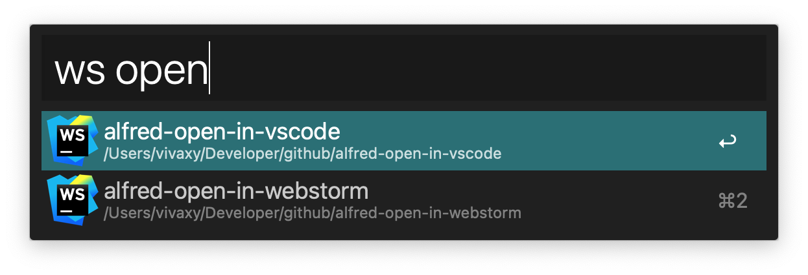

# Alfred Open in WebStorm

[![NPM Version][npm-version-image]][npm-url]
[![NPM Downloads][npm-downloads-image]][npm-url]
[![GPL License][license-image]][license-url]
[![Standard Version][standard-version-image]][standard-version-url]

Alfred 4 workflow to open in WebStorm.

## Feature

- Search projects and open in WebStorm.
- Search projects and reveal in Finder.
- Open selected file in WebStorm.
- Fuzzy search.

## Installation

- `npm i -g alfred-open-in-webstorm`.
- Set workflow environment `wds` to your project base folders (split with ,). e.g. `wds: /Users/vivaxy/Developers/github,/Users/vivaxy/Developers/gitlab`. Workflow searches only first level folders, so make sure `wds` point to them. `wds` stands for `working directories`.

## Usage

- Type `ws` with a space to search. Press `enter` to open selected project in WebStorm. Hold `command` and press `enter` to reveal in Finder.
- Select a file in Finder, type `ws` (without space) and press `enter` to open this folder in WebStorm.

## Related

- [Alfy](https://github.com/sindresorhus/alfy)
- [Alfred Workflow Open in WebStorm](https://vivaxyblog.github.io/2015/06/02/alfred-workflow-open-in-webstorm.html)
- [Alfred 4 Workflow Open in VSCode](https://vivaxyblog.github.io/2019/08/14/alfred-workflow-open-in-vscode.html)
- [Alfred workflow to open in VSCode](https://github.com/vivaxy/alfred-open-in-vscode)

[npm-version-image]: https://img.shields.io/npm/v/alfred-open-in-webstorm.svg?style=flat-square
[npm-url]: https://www.npmjs.com/package/alfred-open-in-webstorm
[npm-downloads-image]: https://img.shields.io/npm/dt/alfred-open-in-webstorm.svg?style=flat-square
[license-image]: https://img.shields.io/npm/l/alfred-open-in-webstorm.svg?style=flat-square
[license-url]: LICENSE
[standard-version-image]: https://img.shields.io/badge/release-standard%20version-brightgreen.svg?style=flat-square
[standard-version-url]: https://github.com/conventional-changelog/standard-version
